## Facebook configuration

To interact with the Facebook API you must create and configure a new Facebook application for your personal use.

- Go to https://developers.facebook.com/apps and click "Add a New App"
  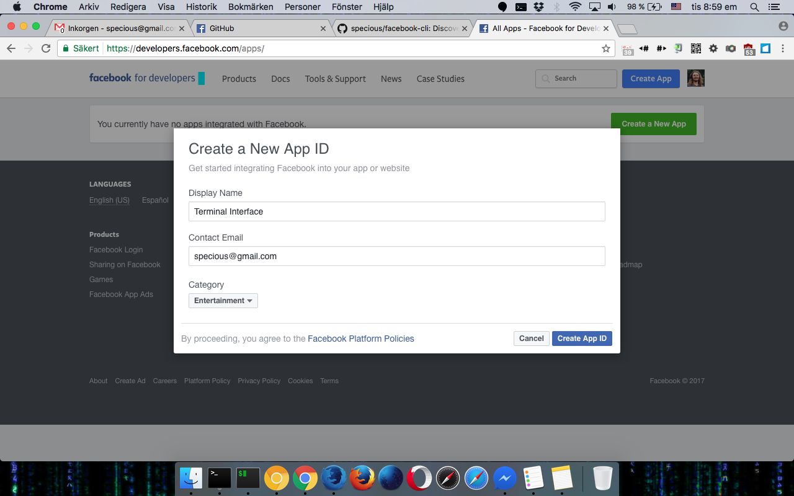
- Go to the "Settings" tab
  - Click "Add Platform"
  - Select "Website"
    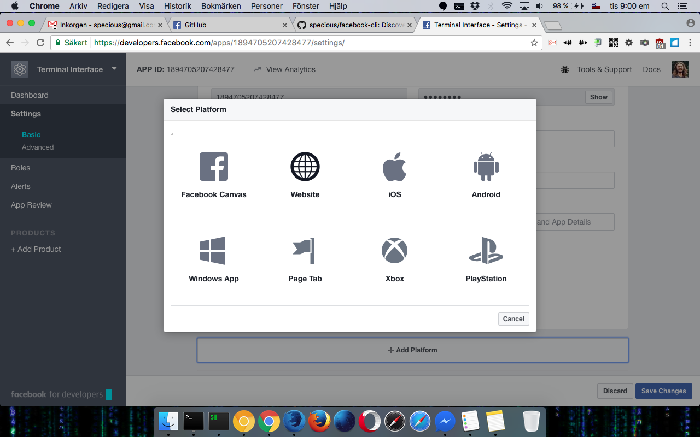
  - Set "Site URL" to `http://localhost`
    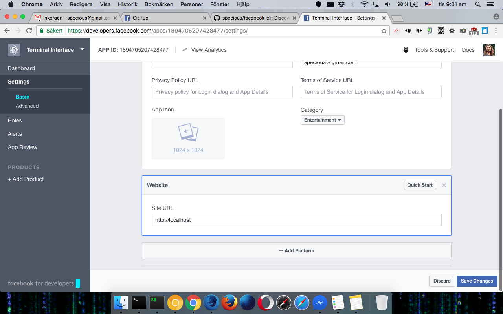
  - Add `localhost` to the "App Domains"
    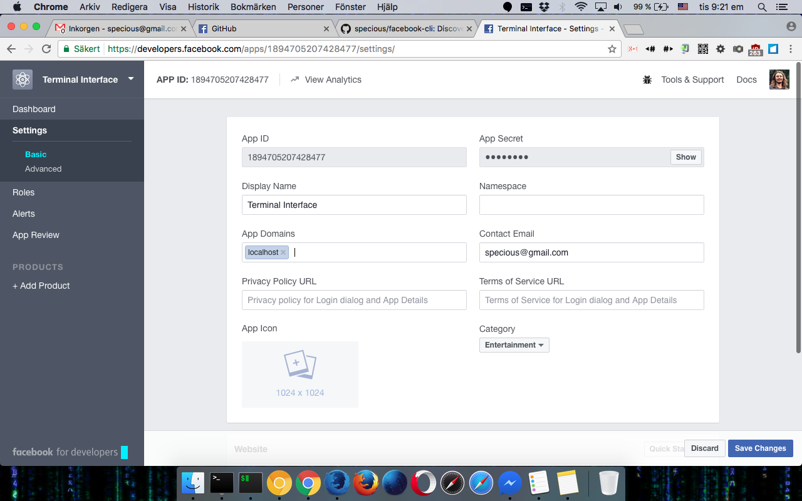
  - Click "Save Changes"
    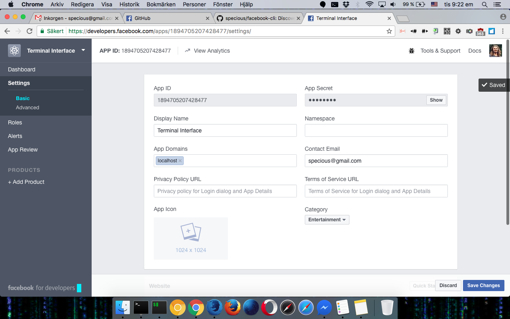
- Go to the "App Review" tab
  - Flip the switch that says "Your app is in **development** and unavailable to the public."
    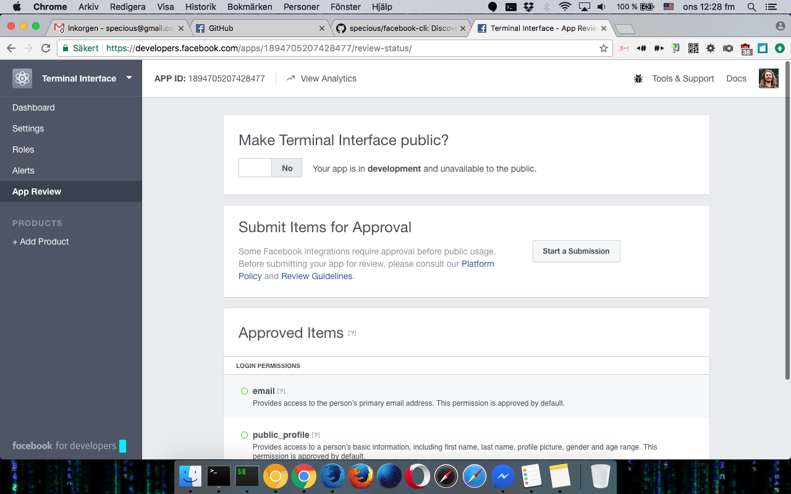
  - Click "Confirm" to make your app live ([why?](# "This is required for any content you publish through this app to be visible to other users."))
    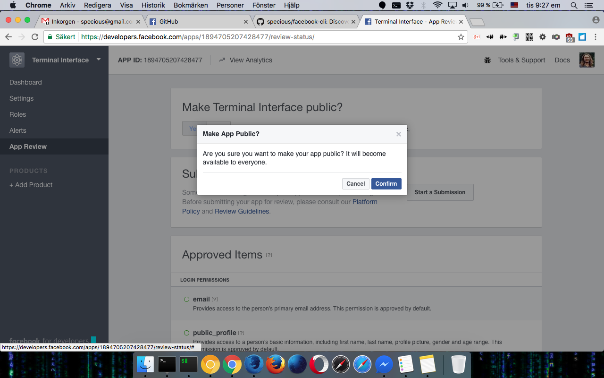
- Go to the "Dashboard" tab
  - Under "App Secret" click "Show" to reveal your app secret
    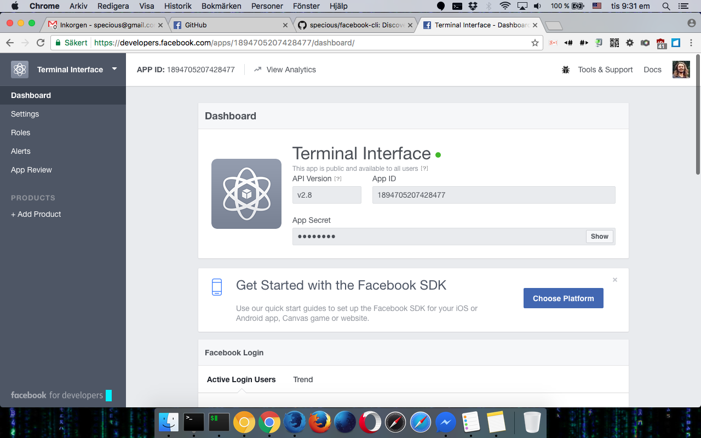
    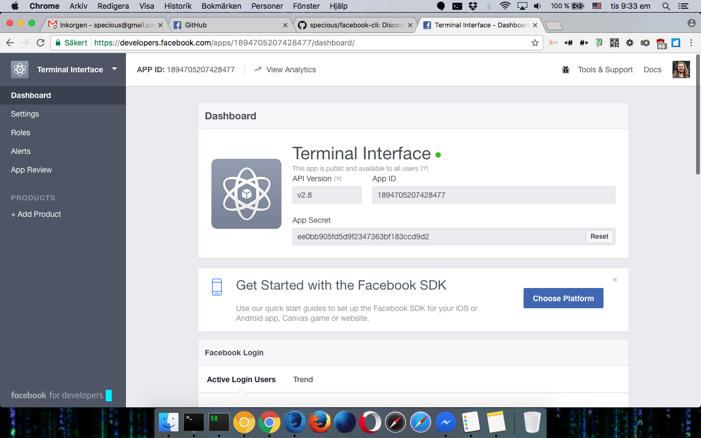
  - Open a terminal and save your App ID and App Secret by running:<br>

    ```
    facebook-cli config --appid=<app-id> --appsecret=<app-secret>
    ```
    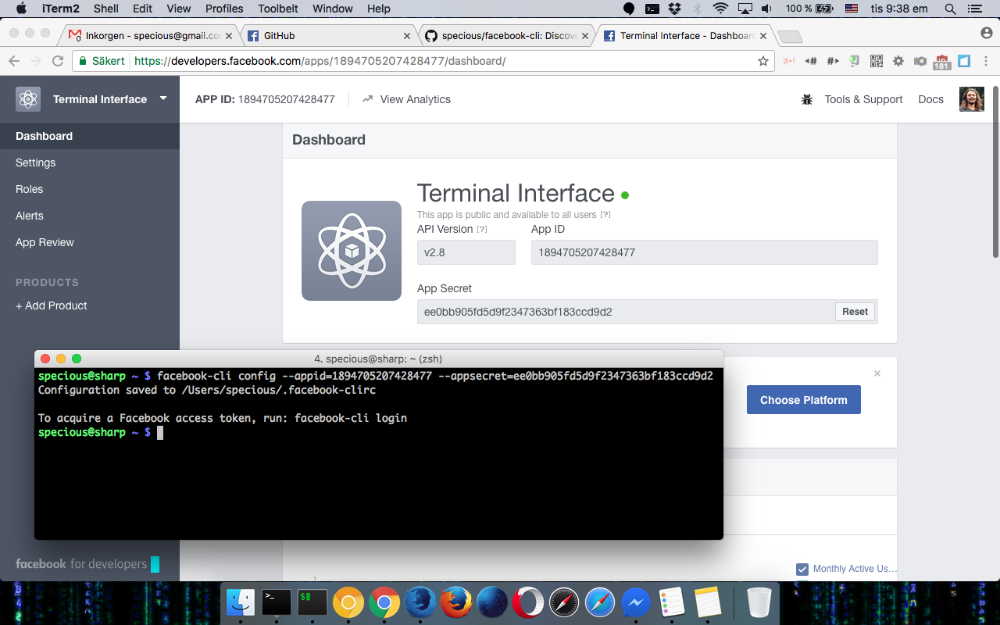

## Logging in

Once configured, you must log into Facebook with your credentials to authorize *facebook-cli* to interact with your profile.

- Open a terminal
  - Run `facebook-cli login`
    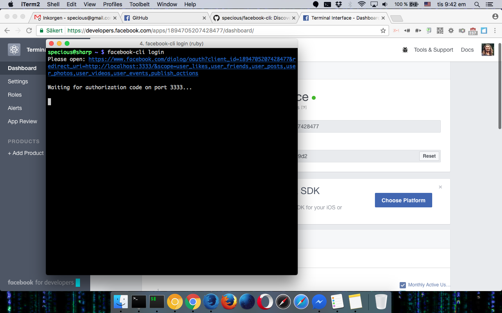
  - Open the URL in a web browser, and log into your Facebook account if prompted
  - Click "Continue" to approve the permissions
    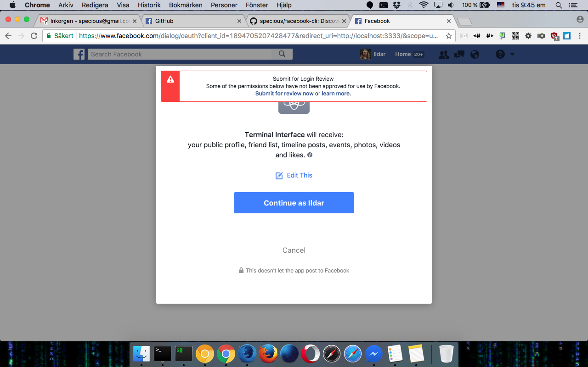
  - Select the scope of your audience for any posts you publish using this application ([read more](https://www.facebook.com/help/211513702214269))
    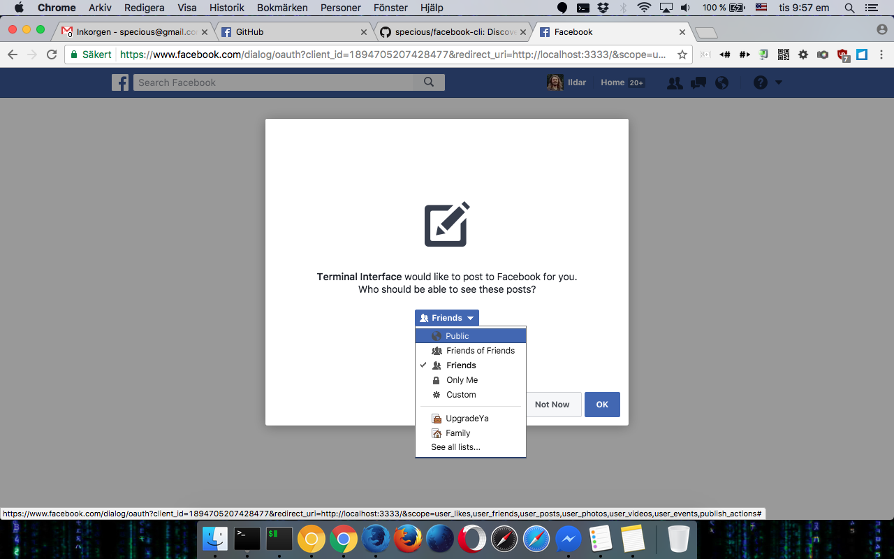
  - Click "Ok" to continue
  - Close the browser tab
    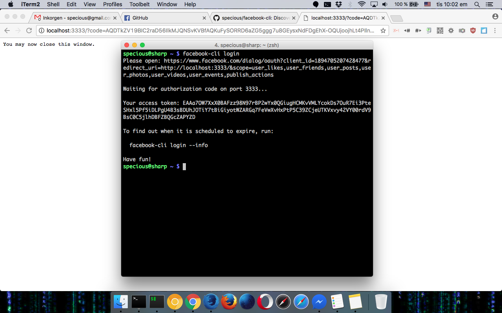